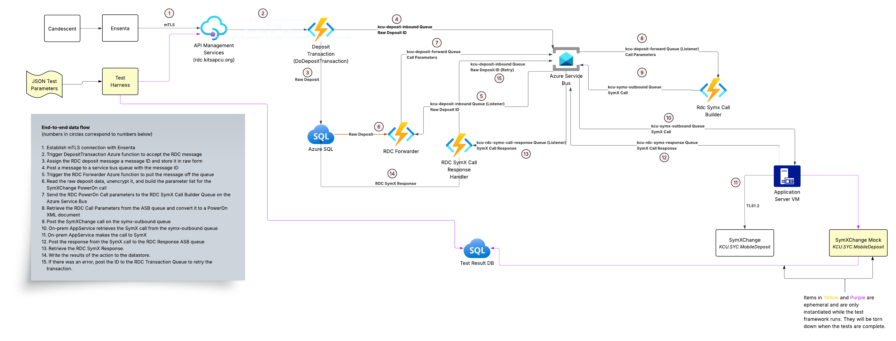

# Welcome to Tsg.Rdc

Tsg.Rdc is a prototype application to test a solution for a remote deposit capture system. 

The solution is built using **.NET 8** and **Azure Functions**.

The application accepts a SOAP message from an external system (Ensenta), processes the message, and transforms it 
into another XML format (Jack Henry SymXChange) before sending it to a mock endpoint. The application is intentionally 
microservice-oriented, with each major step in the process handled by a separate Azure Function.

## Architecture
The architecture of the application is illustrated in the following diagram. The diagram shows the main components
and how they interact with each other. The architecture shown here expects to use Azure Service Bus and Azure SQL for the 
production version, but this prototype uses Azure Storage Queues and Azure Table Storage for simplicity.

## Setup
To run this application locally, follow these [setup instructions](SETUP.md). You will need to create a `local.settings.json`
file with the necessary configuration settings. If you followed the setup instructions, you should be able to just 
copy the provided `local.settings.example.json` file.

## Project Structure
- `Tsg.Rdc/`: The main Azure Functions project.
- `Tsg.Rdc/Triggers/`: The Azure Function triggers. These correspond to triggers in the architecture diagram.
- `Tsg.Rdc/Triggers/Tests/`: HTTP Post triggers that allow testing of the serialization and deserialization of the models. 
Nothing sent to these tests is processed at all. It simply returns the data back to the caller in the opposite format of
what was received (JSON in, XML out; XML in, JSON out). These can be called from Postman.
- `Tsg.Rdc/Model/`: The data models used in the application. All are serializable in Json. The SymX and Ensenta models 
are serializable in XML as well. There are three folders inside this model:
    - the Ensenta XML document
    - the internal structures for the RDC system
    - the SymX XML document
- `Tsg.Rdc/Resources/Samples`: Example XML files for the Ensenta and SymX documents.

## Triggers
The application contains the following Azure Function triggers:
- **`DepositTransaction` (HTTP Trigger)**: Accepts the Ensenta deposit transaction request in XML format. It generates a GUID for
the transactionID and stores the XML message it to an Azure Storage Table. It then places a message on an Azure Storage Queue
  (`deposit-inbound`) to trigger the next step in the process.
- **`RdcForwarder` (Queue Trigger)**: Listens to the `deposit-inbound` queue. When a message is received, it retrieves the corresponding
Ensenta XML from the Azure Table, deserializes it into the Ensenta model, and creates an RDCForwarder object that contains the call
parameters for the SymXChange call. It then places a Json representation of the RDCForwarder object onto another Azure Storage Queue
  (`deposit-forward`).
- **`RdcSymXCallBuilder` (Queue Trigger)**: Listens to the `deposit-forward` queue. When a message is received, it deserializes the Json
into an `RdcCallParams` object, transforms it into the SymXChange model (`SymXSoapEnvelope`) and creates a `SymXCall` object that 
contains the `SymXSoapEnvelope`. It then places a Json representation of the `SymXCall` object onto another Azure Storage Queue
  (`symx-outbound`). In the `SymXCall` object, it also includes a URL for the specific SymXChange instance to be called, the name of the 
PowerOn script to be executed, a unique call ID, and the transaction ID from the original Ensenta message as a correlation ID.
- **[`Tsg.SymxCaller` (Queue Processor)](https://github.com/The-Software-Gorilla/Tsg.SymxCaller)**: This is a separate project that 
listens on the `symx-outbound` queue. When a message is received, it deserializes the Json into a `SymXCall` object, makes the actual
SOAP call to the SymXChange endpoint, stores the response and writes it to the callback queue specified in the call object. This project 
is specifically separated out as the SymX caller has to originate from a trusted network location that needs to be whitelisted with
Jack Henry. It also needs a Jconnect VPN connection to be able to reach the SymXChange endpoint. This is the Application Server VM in
the architecture diagram. The SymxCaller is built into a Docker container for easy deployment.
- **`SymXMockEndpoint` (HTTP Trigger)**: A mock SymXChange endpoint for testing purposes. This function simulates the behavior
of a real SymXChange service by accepting SOAP requests and returning predefined responses. This allows for testing the entire
workflow without needing access to a live SymXChange instance. It also stores the incoming requests and timestamps them in an
Azure Table so we can calculate the round-trip time for the entire process.
- **`RdcSymxResponseHandler` (Queue Trigger)**: Listens to the callback queue specified in the `SymXCall` object. When a message is received,
it processes the SymXChange response, updates the status of the original transaction in the Azure Table, and performs adds the call to 
back to the deposit-inbound queue if it failed for retryable reasons.